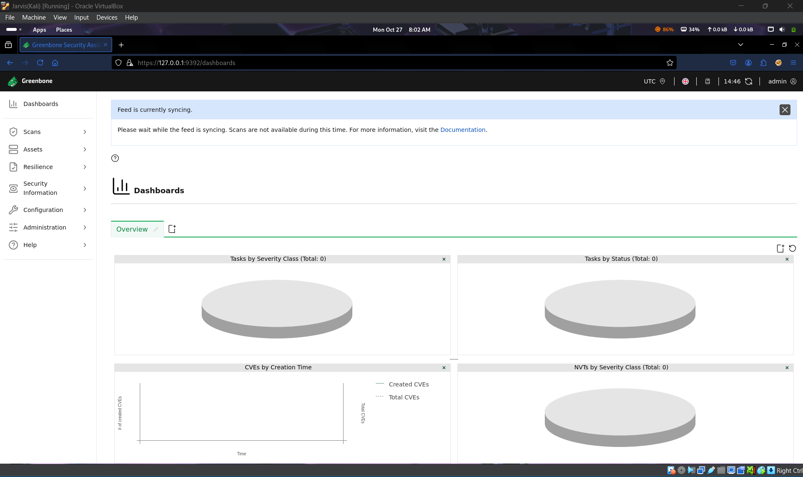
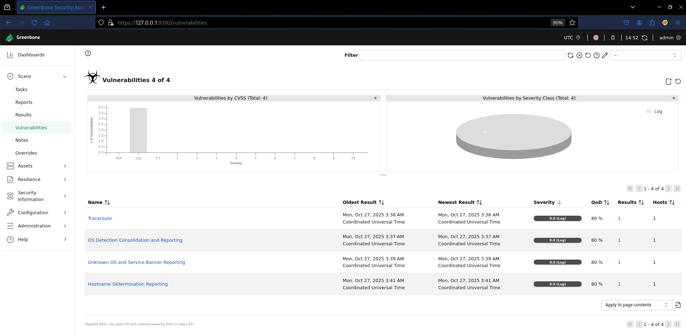

# 🛡️ Task 3 — Basic Vulnerability Scan

**Author:** Pratyush Raj  
**Date:** 26-10-2025  
**Platform Used:** Kali Linux (OpenVAS / Greenbone Vulnerability Manager)  
**Target System:** Windows 10 (IP: 192.168.1.6)  
**Scanner System:** Kali Linux (IP: 192.168.1.5)

---

## 🎯 Objective

To perform a **basic vulnerability assessment** on a Windows 10 machine using **OpenVAS**, identify potential risks, and apply system hardening techniques to improve security posture.

---

## ⚙️ Tools Used

- **OpenVAS / GVM (Community Edition)**  
- **Kali Linux (Scanner VM)**  
- **Windows 10 (Target VM)**  

> Both VMs were configured in a **Host-Only Network** for internal scanning.

---

📂 **Repository Structure**  

Task-3_Basic_Vulnerability_Scan/  
│  
├── 📁 Archive/  
│ └── Interview_Questions.txt  
│  
├── 📁 Report/  
│ └── Task_3_Vulnerability_Scan.pdf  
│  
├── 📁 Screenshots/  
│ ├── Kali_IP.png  
│ ├── New_Target.png  
│ ├── New_Target2.png  
│ ├── OpenVAS_DashBoard.png  
│ ├── Results.png  
│ ├── Vulnerabilities.png  
│ ├── Windows_IP.png  
│ └── reports_scan.png  
│  
└── 📝 Task-3_README.md  

## 🚀 Steps Performed

1. Installed and configured **OpenVAS** on Kali Linux.  
2. Added target host (`192.168.1.6`) in GVM.  
3. Created and executed a **Full and Fast** scan task.  
4. Reviewed scan results and analyzed vulnerabilities.  
5. Applied mitigations (firewall rules, service restrictions, updates).  
6. Conducted a re-scan to verify fixes.

---

## 🧩 Scan Summary

| **Parameter** | **Details** |
|----------------|-------------|
| Total Vulnerabilities | 4 |
| Severity Levels | All Log (Informational) |
| Critical / High | 0 |
| Medium / Low | 0 |
| Log (Info) | 4 |

> _All detected items were informational, indicating a well-secured Windows host._

---

## 🧠 Key Findings

| **Vulnerability** | **Severity** | **Description** |
|--------------------|--------------|-----------------|
| Traceroute | Log | Network path traceable |
| OS Detection Reporting | Log | System fingerprinted |
| Unknown OS/Service Banner | Log | Limited banner info |
| Hostname Determination | Log | Hostname resolved |

> **Result:** No exploitable vulnerabilities found ✅

---

## 🔧 Mitigation Steps

- Configured **Windows Firewall** to block ICMP/traceroute.  
- Disabled **unused services** and **SMBv1 protocol**.  
- Restricted **RDP access** to local network only.  
- Updated **Windows Defender** and installed latest patches.  
- Re-scanned system — only informational logs remained.

---

## 📸 Screenshots

  
  

---

## 🧾 Outcome

- Successfully performed a **vulnerability scan** using OpenVAS.  
- Learned how to interpret results, prioritize risks, and verify mitigations.  
- Gained practical experience in **network scanning, CVSS interpretation, and system hardening**.

---

**© 2025 Pratyush Raj — ElevateLabs Pvt. Ltd. Cyber Security Internship**

